# IBM Bob Java Modernization: Migrating Struts, JSP, and Java Applications to React and Spring Boot

In this document, you will find detailed guidance on how to use IBM Bob, an AI-powered software engineering assistant that helps modernize legacy Java applications with speed, accuracy, and confidence.

In this demo, we modernize PKS Auto Insurance, a monolithic Java application built with Struts 1.3, JSP views, and Hibernate 3.5, running on Java 6.

Using a series of simple prompts, Bob transforms this 20-year-old monolithic application into a modern microservices-based platform built with Spring Boot 3.x, PostgreSQL, JWT-based security, and a React 18 frontend. The solution includes generated documentation, automated tests, deployment assets, and operational artifacts.

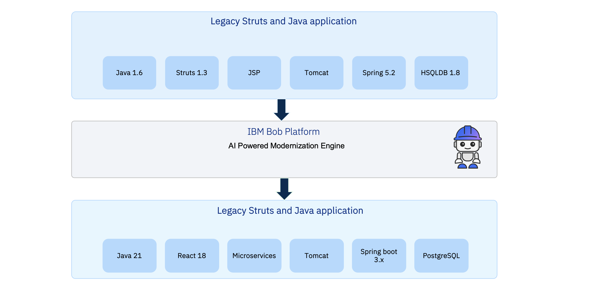

## 1. Legacy Application Section

You can see the classic Struts project files [here](./struts/)

This is [LoginAction.java](./struts/trunk/src/main/java/com/pks/insurance/action/LoginAction.java) — a Struts Action class.

Here's the [struts-config.xml](./struts/trunk/src/main/webapp/WEB-INF/conf/struts-config.xml) — all URL mappings, form beans, and action forwards configured in XML. 

And here is the [service layer](./struts/trunk/src/main/java/com/pks/insurance/service/impl/UserManagerImpl.java) , where the business logic is tightly coupled to the application architecture and lacks automated unit test coverage and all.

This is exactly the kind of legacy code that Bob is designed to modernize.

## 2. Initial Prompt with Bob for Migration

Now let's see Bob in action. We simply describe what we want in the prompt.

1. Download this repo to local folder.

2. Delete the **modernized** folder.

3. Open the folder in IBM bob, 

4. Provide the following prompt to IBM Bob :

```
I have a legacy Java application that I want to modernize into a ReactJS frontend, Spring Boot and Tomcat-based microservices, PostgreSQL database, and deploy on OpenShift.
I need Bob to perform the following tasks:

Analyze the existing application code.
Create an HTML document describing the current application, including its architecture, technology stack, application inventory, dependencies, and other relevant details.
Prepare SRE documentation in HTML format.
Identify and recommend microservices based on Domain-Driven Design (DDD) principles and document them in HTML format.
Create a Bounded Context Map and provide it in HTML format.
Convert the monolithic application into microservices.
Create a traceability matrix between the legacy application and the modernized solution in HTML format.
Create database migration documentation in HTML format.
Perform the database migration to PostgreSQL.
Generate unit test scripts.
Create unit test case documentation in HTML format.
Create integration test case documentation in HTML format.
Generate integration test scripts.
Create a DevSecOps pipeline plan and documentation in HTML format.
Generate Jenkins pipeline scripts for the DevSecOps implementation.
Create Jenkins installation and configuration scripts for OpenShift.
Create deployment scripts and manifests for deploying the microservices on OpenShift.
Additionally, I want to run and test the application on my local Mac. Please provide the required steps, setup instruction, scripts and etc in HTML format.

Please start by analyzing the application and then generate the deliverables one by one in the order listed above.
```

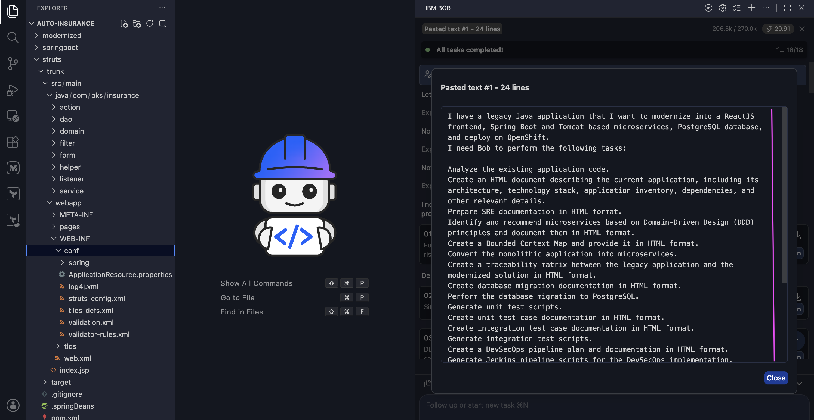

Bob immediately begins reverse-engineering the legacy codebase by extracting business rules, mapping domain models, and identifying bounded contexts. It then forward-engineers a complete modernized platform based on its analysis.

Within moments, three independent Spring Boot microservices appear: user-service, vehicle-service, and premium-service — each with its own schema, security configuration, REST API, and test suite.

The React frontend, Docker Compose file, Jenkins pipeline, OpenShift manifests, and HTML documentation files are all generated in parallel.

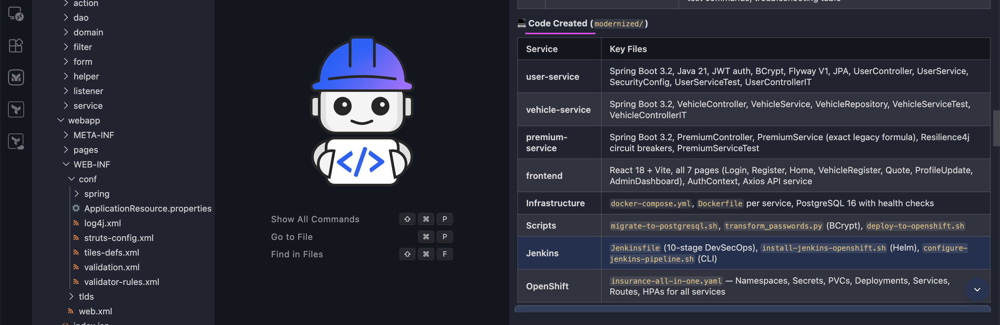


5. Navigate to the generated **modernized** folder (or its equivalent output directory) to review the generated source code, documentation, configuration files, and deployment assets.


## 3. Additional Prompts with Bob for improvements.

What makes Bob truly powerful is that the conversation continues. As we test the application, we encounter real-world issues — and we fix them with plain English prompts.

#### Flyway

1. You can give the prompt to remove the **Flyway** dependency.

Bob removes the Flyway dependency from all three Maven projects, eliminates Flyway-related configuration from the application configuration files, and generates standalone SQL scripts suitable for manual database initialization.

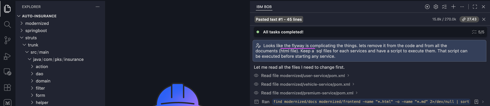

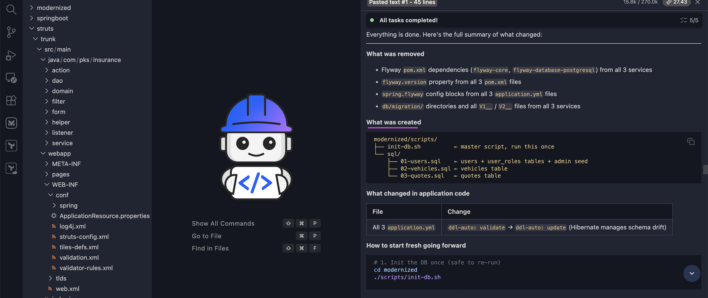

#### CORS


#### CORS Configuration

The frontend was experiencing cross-origin request failures due to missing CORS configuration.

1. Provide a prompt asking Bob to resolve the CORS issue.

Bob identified the root cause and updated the services accordingly.

In the user-service, Bob added a CorsConfigurationSource bean within the SecurityConfig class.

For the vehicle-service and premium-service, Bob configured the required CORS mappings to allow frontend access.

These changes enable secure and reliable communication between the React frontend and the backend microservices.

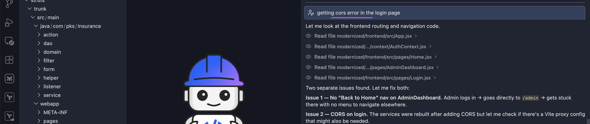

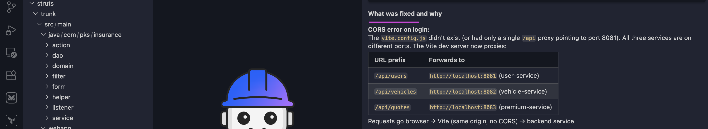

#### React SPA

1. You can give the prompt to fix the **SPA** issue.

With a simple prompt, Bob transforms the user interface into a modern React single-page application (SPA), providing a seamless and responsive user experience.

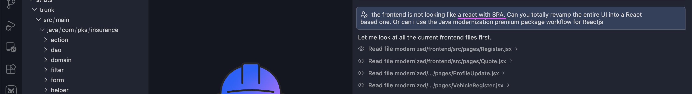

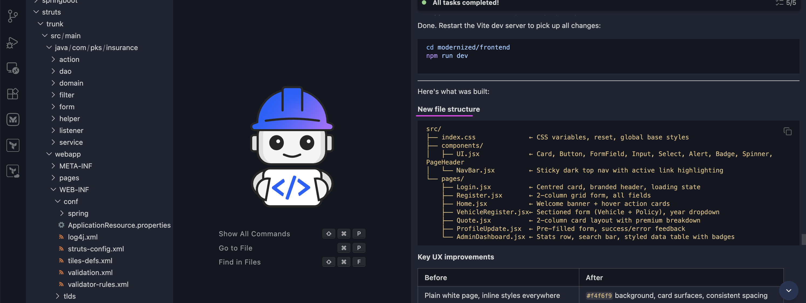


#### Modernization process documents

1. Provide a prompt requesting modernization documentation.

With a single prompt, Bob generates a collection of comprehensive, client-ready HTML documents covering every aspect of the modernization process—from reverse-engineering activities and domain discovery to migration validation and confidence scoring.

These documents are ready to share with stakeholders immediately.

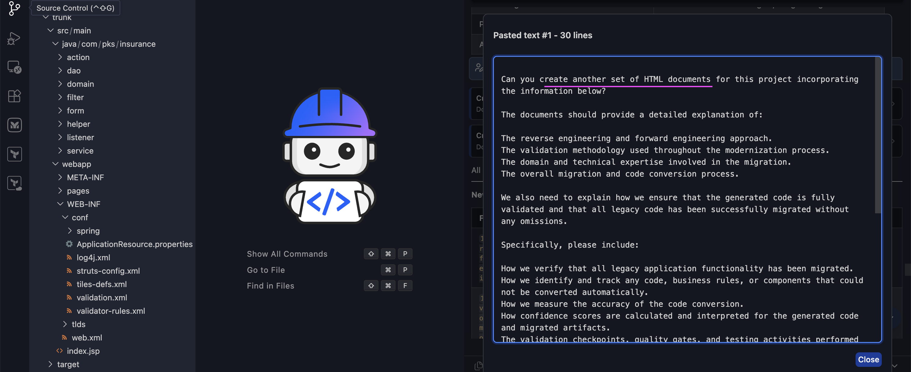

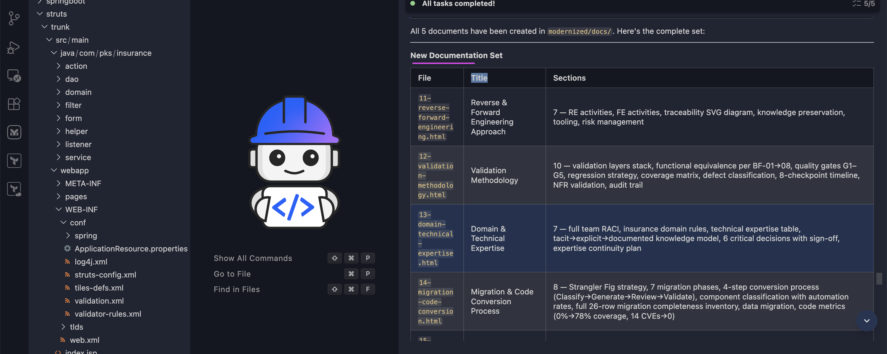

#### Migrated Application

Here is the converted and migrated application.

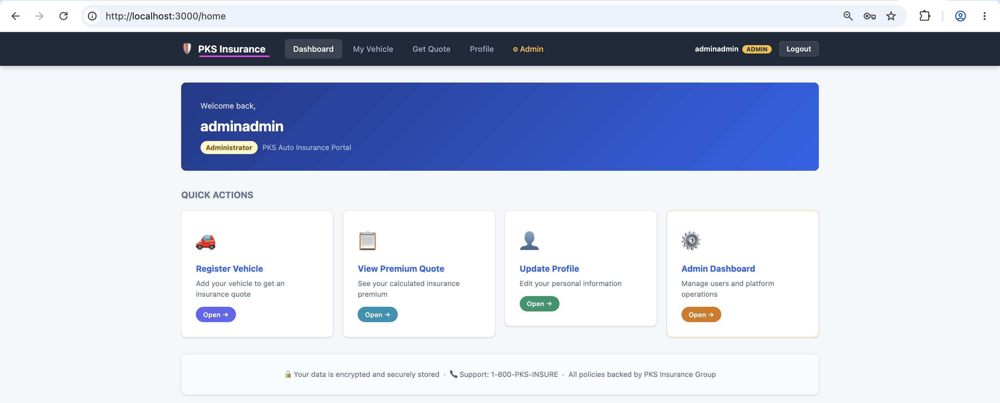


## 4. HTML documentation files

Let's take a moment to walk through everything Bob has produced.

Fifteen HTML documentation files — a complete modernization knowledge base.

### 4.1 Legacy Application Analysis

<details><summary>Click me for more info</summary>

The generated file is available [here](./modernized/docs/01-application-analysis.html)

It includes the following contents.

1. Executive Summary
2. Technology Stack
3. Architectural Overview
4. Application Inventory
5. Database Schema
6. Business Functions
7. Premium Calculation Algorithm
8. Security Assessment
9. Maven Dependency Inventory
10. Technical Debt & Modernization Blockers
11. Target Architecture Summary

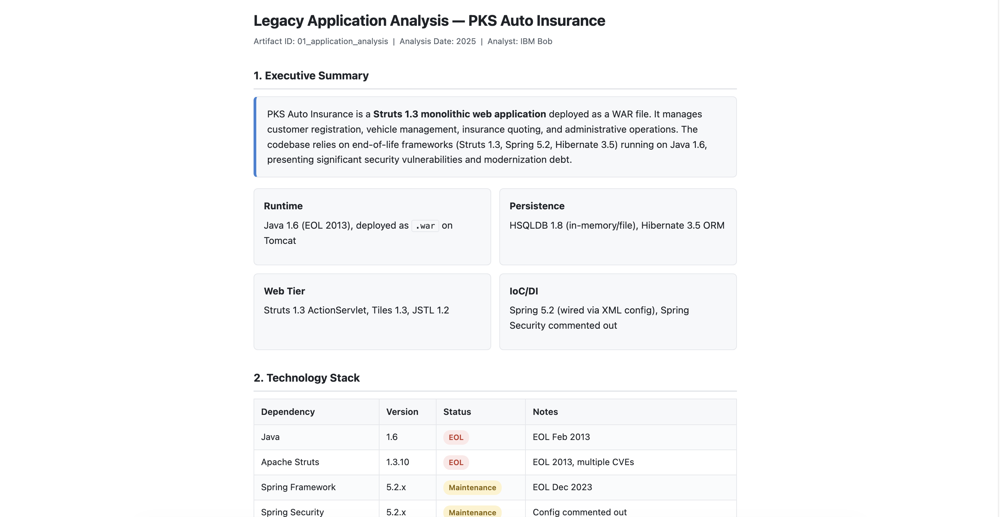

</details>

### 4.2 SRE Documentation

<details><summary>Click me for more info</summary>

The generated file is available [here](./modernized/docs/02-sre-documentation.html)

It includes the following contents.

1. Service Inventory & Ownership
2. Service Level Objectives (SLOs)
3. SLI Definitions
4. Service Level Agreements (SLAs)
5. Health Checks
6. Alerting Rules
7. Incident Management
8. Capacity Planning
9. HPA Policy
10. Observability Stack
11. Backup & Disaster Recovery
12. Change Management Release Gates
13. Key Operational Runbooks
14. Toil Reduction Targets


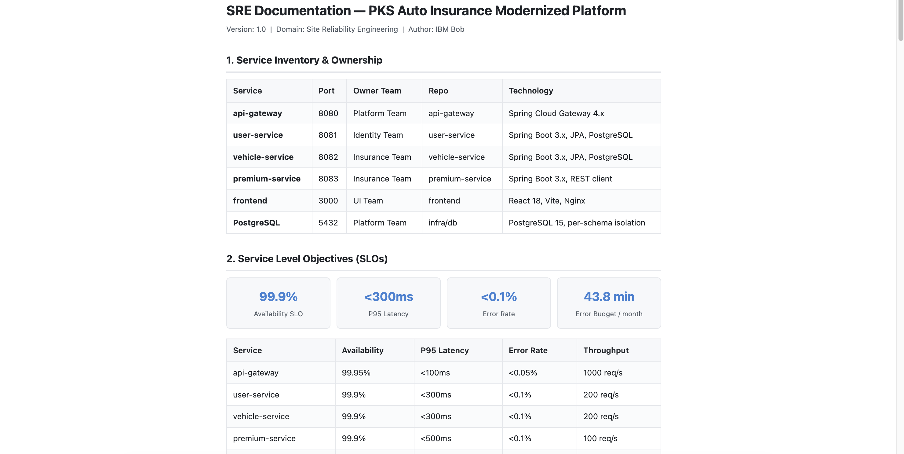

</details>


### 4.3 DDD Microservices Identification & Recommendation

<details><summary>Click me for more info</summary>

The generated file is available [here](./modernized/docs/03-ddd-microservices.html)

It includes the following contents.

1. Domain Discovery & Strategic Design
2. Identified Bounded Contexts
3. Recommended Microservices
4. REST API Contracts
5. Data Ownership Rules
6. Inter-Service Communication
7. Domain Events
8. Decomposition Rationale


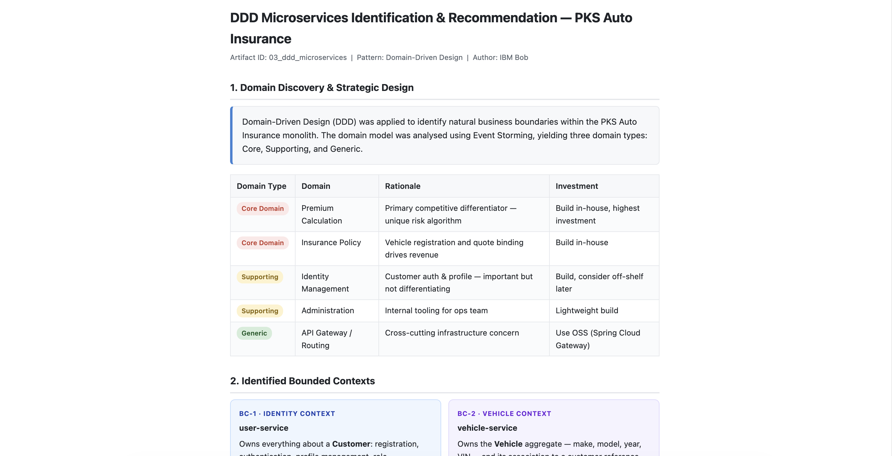

</details>


### 4.4 Bounded Context Map

<details><summary>Click me for more info</summary>

The generated file is available [here](./modernized/docs/04-bounded-context-map.html)

It includes the following contents.

1. Introduction
2. Context Map Diagram
3. Context Relationship Details
4. Integration Patterns Applied
5. Team Topology
6. Colour Legend


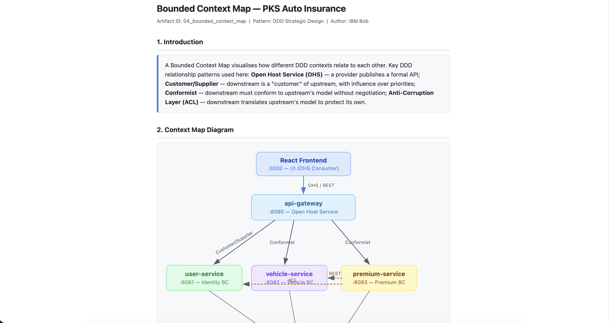

</details>


### 4.5 Traceability Matrix 

<details><summary>Click me for more info</summary>

The generated file is available [here](./modernized/docs/05-traceability-matrix.html)

It includes the following contents.

1. Action Classes → REST Controllers
2. Service Layer → Service Layer
3. DAO Layer → Repository Layer
4. Domain Model → JPA Entities
5. View Layer → React Components
6. Configuration → Modern Configuration
7. Security Improvements Summary

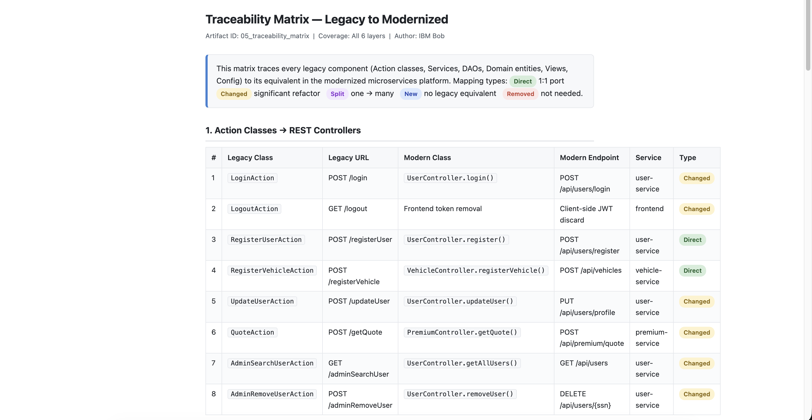

</details>

### 4.6 Database Migration Documentation

<details><summary>Click me for more info</summary>

The generated file is available [here](./modernized/docs/06-database-migration.html)

It includes the following contents.

1. Migration Strategy
2. Schema Changes: CUSTOMER → users
3. Schema Changes: VEHICLE → vehicles
4. Schema Changes: USER_ROLE → user_roles
5. Data Migration Scripts
6. SQL Init Scripts
7. Rollback Plan

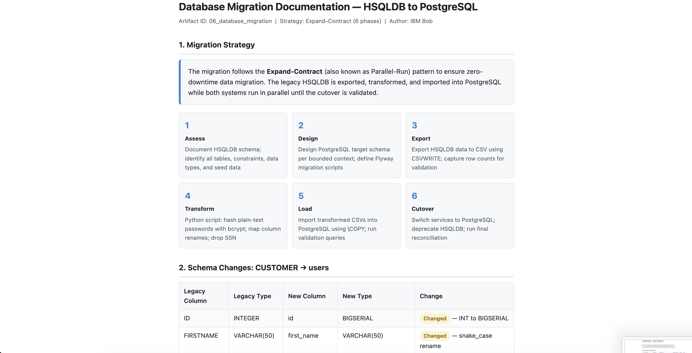

</details>


### 4.7 Unit Test Case Documentation 

<details><summary>Click me for more info</summary>

The generated file is available [here](./modernized/docs/07-unit-test-cases.html)

It includes the following contents.

1. user-service — UserServiceTest
2. vehicle-service — VehicleServiceTest
3. premium-service — PremiumServiceTest
4. JwtUtil — JwtUtilTest
5. Test Coverage Targets


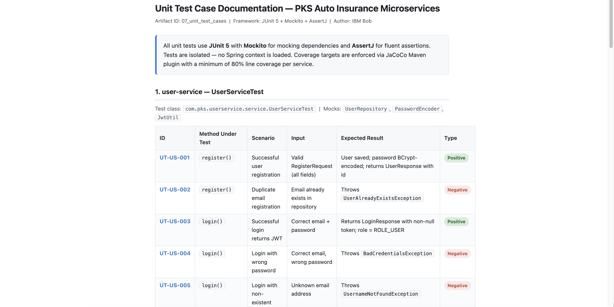

</details>


### 4.8 Integration Test Case Documentation

<details><summary>Click me for more info</summary>

The generated file is available [here](./modernized/docs/08-integration-test-cases.html)

It includes the following contents.

1. User Registration & Authentication Flow
2. Vehicle Registration Flow
3. Premium Quote End-to-End Flow
4. Admin Operations Flow
5. Profile Update Flow
6. Test Environment Setup


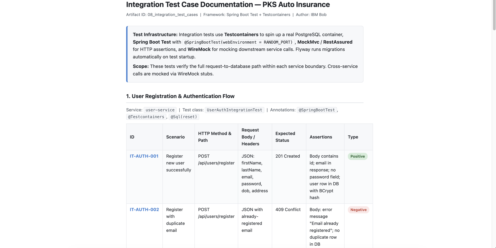

</details>


### 4.9 DevSecOps Pipeline Plan
<details><summary>Click me for more info</summary>

The generated file is available [here](./modernized/docs/09-devsecops-pipeline.html)

It includes the following contents.

1. Pipeline Architecture
2. Pipeline Stage Definitions
3. Security Gates Summary
4. Branch & Trigger Strategy
5. Artifact Management
6. Compliance & Audit Requirements


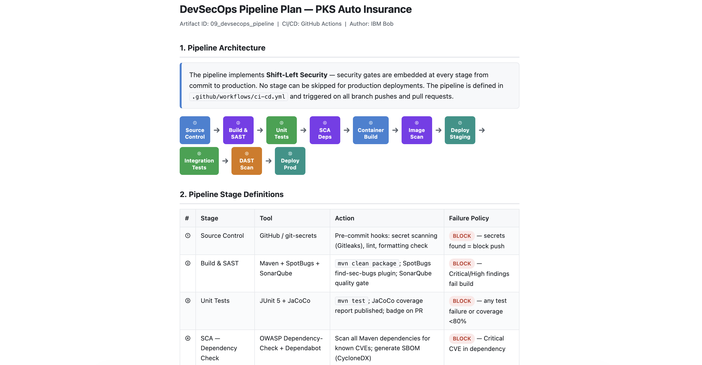

</details>


### 4.10 Local Mac Development Setup Guide
<details><summary>Click me for more info</summary>

The generated file is available [here](./modernized/docs/10-local-mac-setup.html)

It includes the following contents.

1. Prerequisites
2. Quick Start via Docker Compose
3. Manual Development Setup
4. Testing the API Manually
5. Running Tests Locally
6. Troubleshooting
7. Environment Variables Reference
8. Useful Development Commands
9. Default Login Credentials


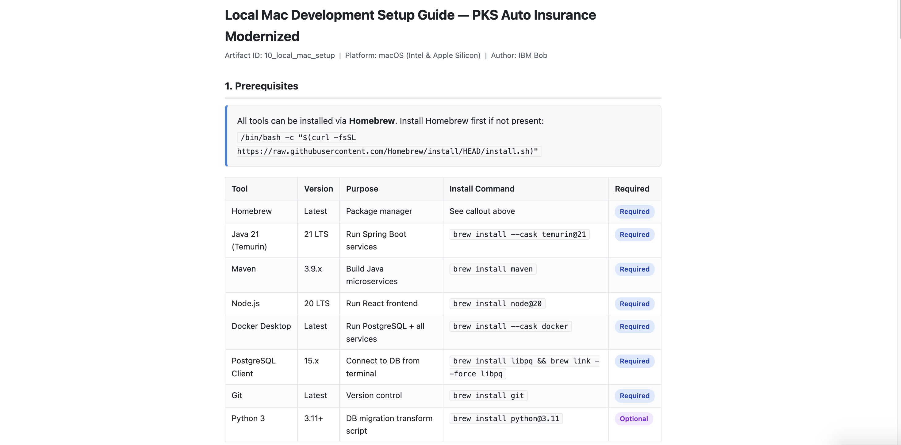

</details>

### 4.11 Reverse & Forward Engineering Approach

<details><summary>Click me for more info</summary>

The generated file is available [here](./modernized/docs/11-reverse-forward-engineering.html)

It includes the following contents.

1. Overview
2. Reverse Engineering Activities
3. Forward Engineering Activities
4. Traceability Chain
5. Knowledge Preservation
6. Tooling & Automation
7. Risk Management in RE/FE

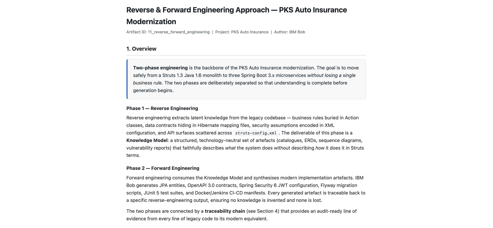

</details>


### 4.12 Validation Methodology
<details><summary>Click me for more info</summary>

The generated file is available [here](./modernized/docs/12-validation-methodology.html)

It includes the following contents.

1. Validation Philosophy
2. Validation Layers
3. Functional Equivalence Verification
4. Quality Gates
5. Regression Strategy
6. Test Coverage Matrix
7. Defect Classification & Resolution
8. Validation Checkpoints Timeline
9. Non-Functional Validation
10. Evidence & Audit Trail


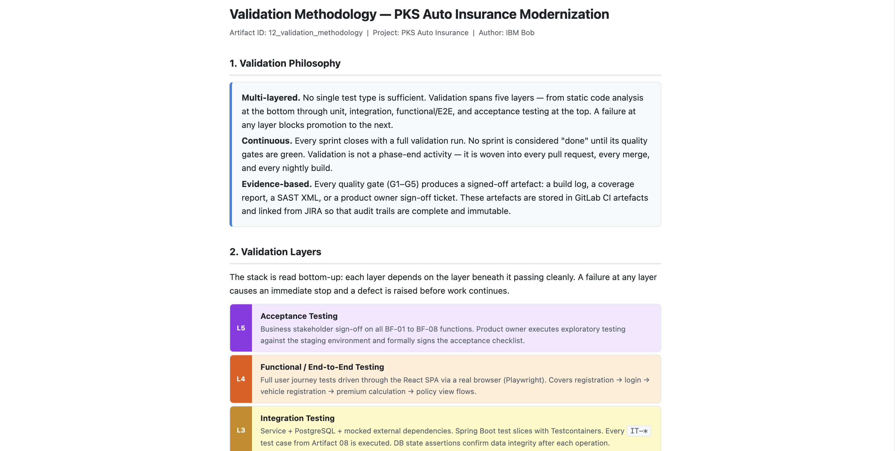

</details>

### 4.13 Domain & Technical Expertise
<details><summary>Click me for more info</summary>

The generated file is available [here](./modernized/docs/13-domain-technical-expertise.html)

It includes the following contents.

1. Executive Overview
2. Team Structure & Roles
3. Domain Expertise Applied
4. Technical Expertise Applied
5. Legacy Knowledge Preservation
6. Critical Domain Decisions
7. Expertise Continuity


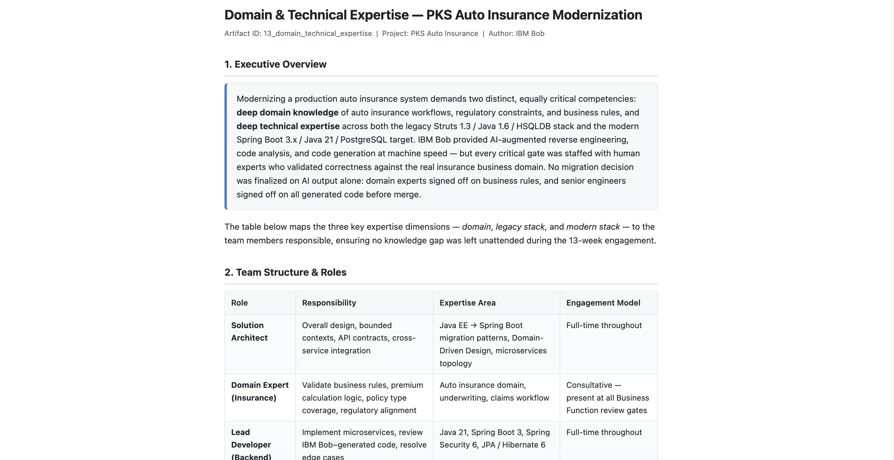

</details>

### 4.14 Migration & Code Conversion Process
<details><summary>Click me for more info</summary>

The generated file is available [here](./modernized/docs/14-migration-code-conversion.html)

It includes the following contents.

1. Migration Strategy Overview
2. Migration Phases
3. Code Conversion Approach
4. Component Classification
5. What Was Not Auto-Converted (Manual Items)
6. Migration Completeness Tracking
7. Data Migration
8. Code Metrics


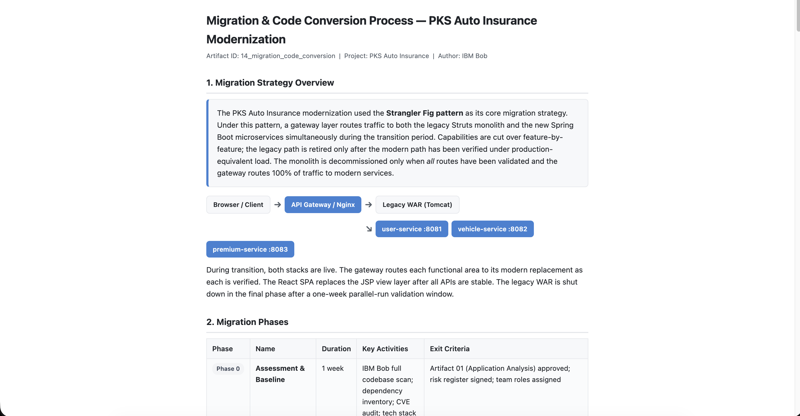

</details>

### 4.15 Confidence Scoring & Migration Accuracy
<details><summary>Click me for more info</summary>

The generated file is available [here](./modernized/docs/15-confidence-scoring.html)

It includes the following contents.

1. Overview
2. Confidence Score Model
3. Per-Artifact Confidence Scores
4. Overall Project Confidence
5. How Behavioral Equivalence Is Measured
6. Confidence Degradation Factors
7. Issue Registry (Found During Review)
8. Confidence Score Trend
9. Sign-off Matrix

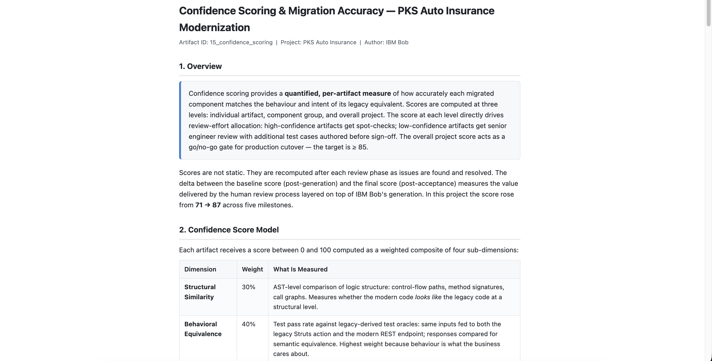

</details>


## 5. Conclusion

Using a series of natural-language prompts, Bob generated three independently deployable Spring Boot 3.x microservices running on Java 21, secured with JWT and BCrypt authentication, backed by PostgreSQL, tested using Testcontainers, containerized with Docker, and prepared for deployment to OpenShift through a DevSecOps pipeline.

The result is more than a code conversion exercise. The client receives a complete modernization package, including production-ready source code, automated tests, deployment assets, operational runbooks, validation evidence, architecture documentation, and migration confidence metrics.

Together, these deliverables provide a clear path from legacy modernization to production deployment while preserving business functionality and improving maintainability, scalability, and operational readiness.